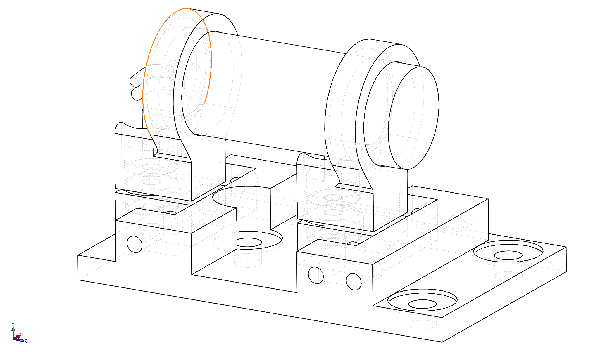
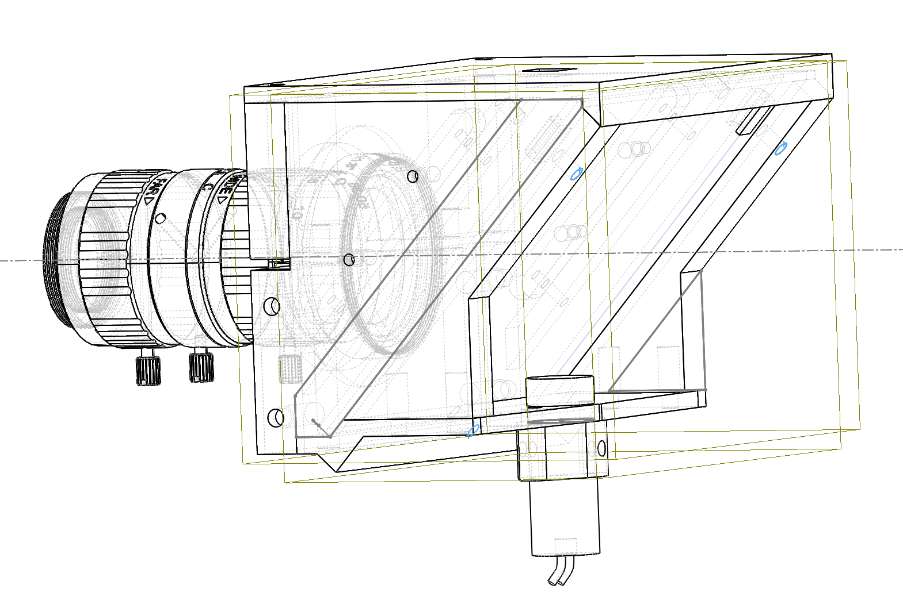
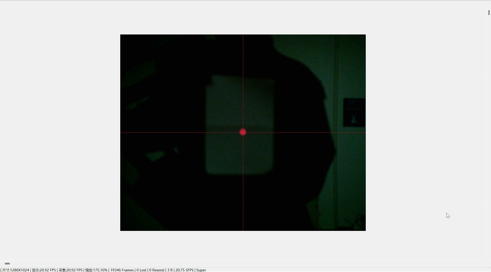
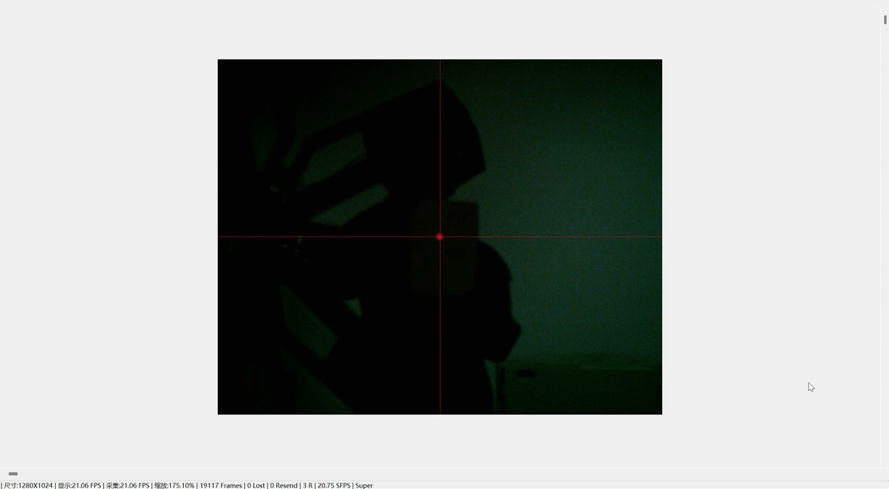
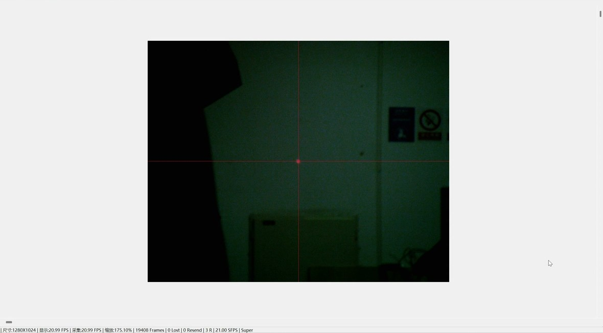

# 当我们发现激光永远打不中无人机时

一个雷达组的三代激光座踩坑记录 | RM2026开源分享

>我们从学枪械瞄准开始，折腾了精密调节底座，最后靠一块半反半透镜和"三点确定平面"的原理搞定了光轴同轴。GitHub链接在文末，需要自取。

---

## 一、事情的开始

今年规则加了无人机反制，雷达组接到的活是：相机看到无人机，激光打上去干扰。

第一反应：这不就是瞄准吗？学枪械那种三点一线就行了。

**但这里有个坑。**

子弹是抛物线，枪械的表尺瞄准是通过角度补偿让弹道在特定距离（比如50米）与瞄准线相交。但激光是**纯直线**，没有弹道下坠。你按20米校准好，目标到了15米或30米时，激光落点相对于相机画面中心的位置会偏移。

简单说：**距离变了，瞄准点就变了**。

无人机在飞，距离一直在变。虽然理论上可以通过无人机在画面中的像素大小反推距离，然后实时调整，但——
- 无人机在画面里只占一小块像素
- 距离算不准
- 算法复杂还滞后

此路不通。

---

## 二、第二版：强行让激光平行于光轴

既然不能"瞄准"，那就让激光**完全平行于相机光轴**？这样无论多远，激光点相对于画面中心的位置应该不变。

于是设计了一个**精密调节底座**：
- 激光头放相机正上方
- 用三颗精密螺丝调节俯仰、偏摆、位置
- 目标是让激光射线与相机光轴完全平行

**然后被现实教育了。**

要实现真正的平行调节，至少需要三颗螺丝（三点确定一个平面）。但三颗螺丝带来噩梦复杂度：

1. **刚度**：底座必须够刚，不能变形
2. **体积**：为了贴近光轴，结构必须小巧
3. **精度**：3D打印根本撑不起这种精密活
4. **耦合**：三颗螺丝互相影响，调了这颗那颗又偏

最后做出来的版本只实现了两颗螺丝——只能调左右和偏摆，无法实现完整平面调节。而且3D打印件的精度让我们心里没底：理论上还是有误差，虽然小了，但不是零。

这版成了备用件，继续找更优雅的解法。

---

## 三、灵光一现

沉下心来画图分析，发现**激光落点与画面中心的误差本质上是个三角形**。只要激光射线无限接近光轴，误差就能压到极限——小于一个像素，直接忽略。

怎么在低成本、3D打印的限制下实现"无限接近"？

突然想到：**三点确定一个平面**。

如果我把激光射在一个可调节的反射面上，通过三颗螺丝调节这个面，不就能让反射光指向任意方向？

**等等，如果我不需要"任意方向"，只需要"与光轴重合"呢？**

与其让激光平行于光轴，不如让激光与光轴**共线**——共用同一根光轴。

方案：
- 相机前方45度放一块**半反半透镜**
- 相机从后方看透射光（损失50%）
- 激光从下方射入，在镜面上反射90度向前（损失50%）
- 两束光完全重合，共享同一根出射光轴

当光轴距离 $d = 0$，无论目标距离 $R$ 是10米还是100米，视差误差都是零。

这就是第三版光轴同轴反射设计。

---

## 四、实际做出来的样子

### 硬件清单

- **相机**: MindVision MV-SUA134GC
- **镜头**: 海康 MVL-HV1050M（10-50mm变焦，C口）
- **激光头**: 直径12mm插拔式（650nm，<1mW）
- **半反半透镜**: 光学玻璃，45度安装，**反射比例选相对高的**
- **固定件**: M2/M3镶嵌螺母（热熔铜螺母）

**注意**: 激光座是专门为海康MVL-HV1050M镜头设计的连接结构，激光头插孔12mm，其他型号可能要改。

### 结构布局

---

## 五、那些没料到的问题

### 1. 结构内反射的红斑

激光通过半反半透镜后，会在结构内部多次反射，导致相机成像画面出现**红斑干扰**。

**解决方案**：
- 内部贴**黑色绒布**（吸光，最大限度减小杂散反射）
- 选用**反射比例相对高**的半透镜（让更多光按预定路径走，减少在内部乱窜的光）

没法完全杜绝，但能把干扰压到可接受范围。

### 2. 固定方式

所有固定点都用**M2或M3的镶嵌螺母**（热熔铜螺母），比直接拧塑料可靠多了，拆装也不容易滑丝。

### 3. 光功率损失

半反半透镜让相机和激光都损失50%光。解决方案：
- 相机选高灵敏度的（MV-SUA134GC刚好够用）
- 激光功率选高但符合安全规范（<1mW）

### 4. 45度角度要准

用角度规校准，误差控制在±1度以内，否则光轴不重合。

---

## 六、为什么没测试前两版

第一版（枪械瞄准思路）和第二版（精密调节底座）虽然都做了实物，但理论分析阶段就发现**原理性缺陷**：

- 第一版：距离变化导致瞄准点偏移是光学几何必然，改结构也解决不了
- 第二版：即使调到极限，3D打印精度的残余误差依然存在，理论上无法达到"误差小于一个像素"

我们的信条：**理论上走不通的，现实大概率也走不通；理论上能走的，现实也不一定好走。**

当然这是纯工程角度。如果是科研探索，多测测数据当然好，但我们面对的是**有明确指标的工程问题**——必须在各种距离下稳定命中。理论已经说"此路不通"，继续测就是浪费时间。

所以前两版成了备用件，精力全投入第三版。

---

## 七、测试效果图

- **5米**：

- **10米**：

- **15米**：

---

## 八、三代方案对比

| 维度 | 第一代（枪械瞄准） | 第二代（精密调节） | 第三代（光轴同轴） |
|-----|------------------|------------------|------------------|
| 核心思路 | 仿枪械三点一线 | 机械调节使激光平行光轴 | 光学反射使激光共线光轴 |
| 理论基础 | 弹道抛物线补偿 | 几何平行 | 光轴重合（$d=0$） |
| 视差问题 | 严重（随距离线性偏移） | 中等（残余误差） | **解决（零误差）** |
| 实现难度 | 低 | 高（精密机械） | 中（光学装配） |
| 3D打印可行性 | 高 | **低**（精度不够） | 高（结构简单） |
| 测试投入 | 几乎无（理论否决） | 几乎无（理论否决） | **完整测试** |
| 最终状态 | 废弃 | 备用 | **现役** |

---

## 九、开源文件

这是个**抛砖引玉的小分享**，不是长期维护的开源项目，文件可能没那么完善，但核心思路都在。

**GitHub**: [https://github.com/PIP-AlgorithmGroup/RM2026_LaserMount](https://github.com/PIP-AlgorithmGroup/RM2026_LaserMount)

包含：
- `STEP/` - 激光座3d模型（step格式）
- `assets/` - 图片资源
- `Doc/` - 简单说明
- 装配靠图文和你的悟性了（逃

### 调试

1. 5米放标定板，验证激光点与图像中心重合
2. 逐步加到15m、20m，确认位置不变
3. 有偏差就微调透镜角度（利用"三点确定平面"原理小范围调）

---

## 十、写在最后

从学枪械瞄准到折腾精密底座，最后发现答案在初中物理的"三点确定一个平面"。工程问题有时候不需要高深算法，找到最本质的几何关系，用最简单的结构实现就行。

**关于这次开源的背景**：我们今年没有通过对抗赛的完整形态考核，只去打了联盟赛。所以这个方案虽然在我们有限的测试里表现不错，但还没有经过对抗赛这种最高强度的实战检验。把它开源出来，希望能给还能去对抗赛的队伍一些参考——如果有队伍在赛场上验证了这个设计，欢迎回来交流实战效果。

希望这个分享能帮到有同样困扰的队伍。赛场上见。

---

License: MIT